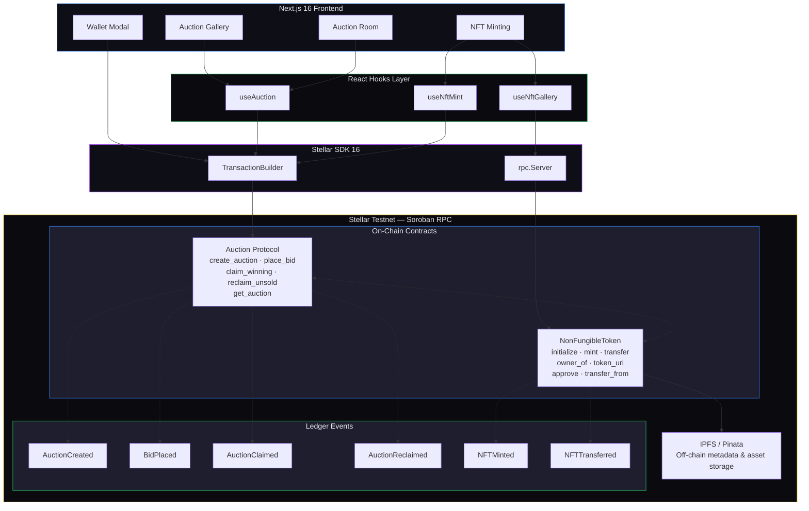
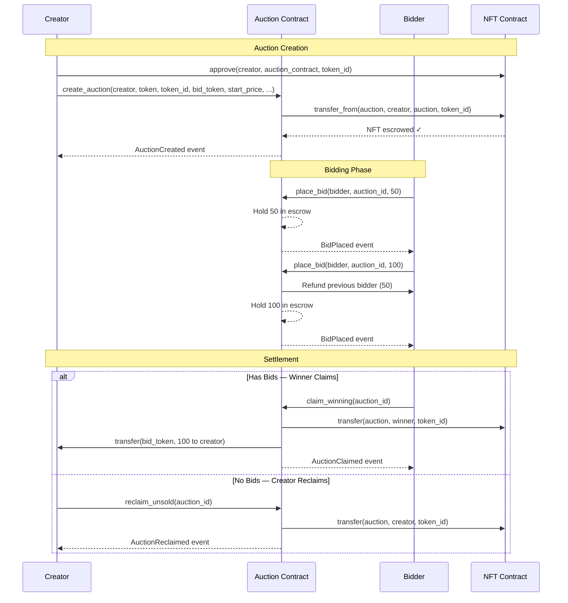
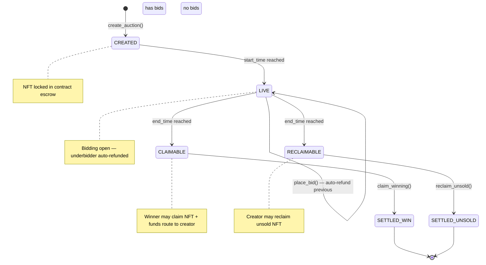
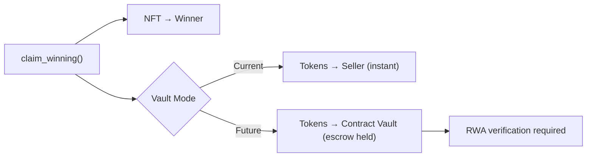
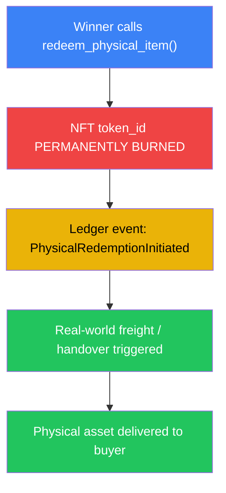
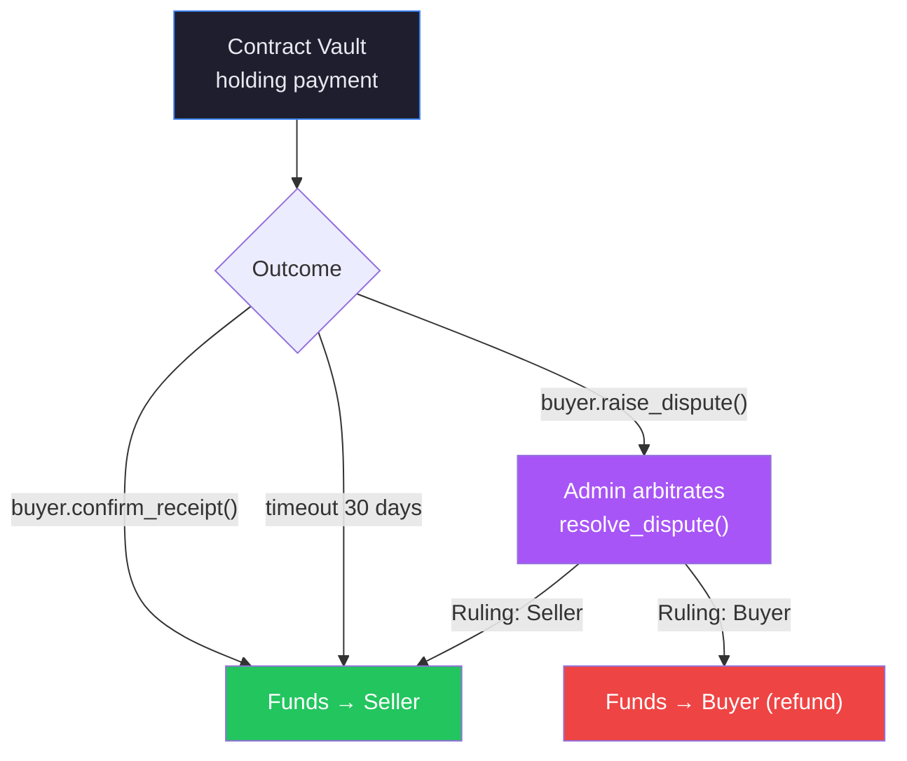
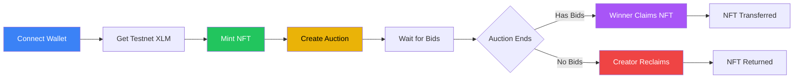

<div align="center">

# ⬡ ZENITH AUCTION

### Advanced Soroban NFT Auction Protocol on Stellar

**Bridging digital liquidity with unique physical assets via secure on-chain escrow and decentralized asset verification.**


---

</div>

## Table of Contents

- [🏆 Level 2 — Submission Requirements](#-level-2--submission-requirements)
- [🚀 Level 3 — Advanced Requirements](#-level-3--advanced-requirements)
- [Architecture Overview](#-architecture-overview)
- [Screenshots & Preview](#-screenshots--preview)
- [Core Engineering Architecture](#-core-engineering-architecture)
- [Exclusive Production Features](#-exclusive-production-features)
- [Contract Addresses](#-contract-addresses-testnet)
- [Smart Contract API Reference](#-smart-contract-api-reference)
- [Frontend Architecture](#-frontend-architecture)
- [Future Roadmap & The RWA Bridge](#-future-roadmap--the-rwa-bridge)
- [Setup & Local Development](#-setup--local-development)
- [Project Structure](#-project-structure)
- [License](#-license)
- ## Live Deployment Link: https://zenith-auction-2akl.vercel.app
- ## Demo Video Link: https://drive.google.com/drive/folders/1iVw-1kCOSY0ssVaMpXwAL5LEdW7bvFUT
    


---

## 🏆 Level 2 — Submission Requirements

<div align="center">

**All core requirements successfully implemented and verified ✅**

</div>


<br>

| Requirement | Status | Implementation Details |
|:---|:---:|:---|
| **🛡️ 3 Error Types Handled** | ✅ | **Frontend:** `Simulation failed`, `Transaction failed`, `Wallet not connected`<br>**Contract:** `NotFound`, `NotActive`, `BidTooLow`, `NotOnAllowlist`, `AlreadyClaimed`, `NoBids`, `HasBids`, `NotEnded`, `NotWinner` (9 on-chain error variants) |
| **🚀 Contract Deployed on Testnet** | ✅ | **Auction Protocol:** `CBOWY2IVHYVG2WQKJV6D32IZIQMXLACNPU3MA4LVX5FRZ5SKCL27IMHZ`<br>**NFT Minting:** `CAIGJDU3F54SCETYVG25SIGDIVLQSYVB3DTPHCBULRPWC3SWSIJXLIK6`<br>Network: Stellar Testnet |
| **📡 Contract Called from Frontend** | ✅ | `useAuction` hook orchestrates full Soroban transaction lifecycle:<br>• `create_auction` — Create and escrow NFTs<br>• `place_bid` — Submit bids with auto-refunds<br>• `claim_winning` — Winner claims NFT + funds<br>• `reclaim_unsold` — Creator reclaims unsold NFT |
| **👁️ Transaction Status Visible** | ✅ | Real-time status tracking: `idle` → `submitting` → `success/error`<br>• Spinner animations during signing<br>• Error messages with detailed diagnostics<br>• Post-claim verification with TX hash and token balance |
| **📝 2+ Meaningful Commits** | ✅ | Multiple commits covering:<br>• Core contract development<br>• Frontend scaffolding<br>• Bid tracking features<br>• NFT minting integration<br>• Wallet & UI improvements |

---

## 🚀 Level 3 — Advanced Requirements

<div align="center">

**Production-grade features and architecture for enterprise deployment**

</div>

<br>

### 🔧 Advanced Smart Contract Development

| Feature | Description |
|:---|:---|
| **Dual-Contract Architecture** | Separate concerns: NFT lifecycle (`nft_mint`) + Auction engine (`zenith-auction`) |
| **Atomic Operations** | Multi-step transactions execute atomically — escrow, refunds, and transfers in single tx |
| **Custom Error Types** | 9 distinct auction errors + 4 NFT errors for precise error handling |
| **Auto-Incremented IDs** | Global counters for auction IDs and token IDs prevent collisions |
| **Event Emission** | 6 custom ledger events for full audit trail |

### 🔗 Inter-Contract Communication

| Mechanism | Implementation |
|:---|:---|
| **NFT Escrow** | Auction contract calls `transfer_from()` on NFT contract to lock assets |
| **Cross-Contract Reads** | Frontend reads NFT metadata via `token_uri()` simulation calls |
| **Approval Pipeline** | Creator approves auction contract → Contract escrows NFT → Settlement transfers |
| **Token Transfers** | Bid token refunds and settlements via Soroban token `Client::transfer()` |

---

## Contract Addresses (Testnet)

| Contract | Address |
|---|---|
| **Auction Protocol** | `CBOWY2IVHYVG2WQKJV6D32IZIQMXLACNPU3MA4LVX5FRZ5SKCL27IMHZ` |
| **NFT Minting** | `CAIGJDU3F54SCETYVG25SIGDIVLQSYVB3DTPHCBULRPWC3SWSIJXLIK6` |
| **Network** | Stellar Testnet (`Test SDF Network ; September 2015`) |
| **RPC** | `https://soroban-testnet.stellar.org` |

## Auction Contract deployment transaction link: https://stellar.expert/explorer/testnet/tx/5d3aa613f777d8f353cd105df992608c307b916ce0cd5d39b0610ff88a0eccf1
## NFT Contract deployment transaction link: https://stellar.expert/explorer/testnet/tx/7a2ba79103838fae8a50a6562e7a08dbce34287212df30854e9a080adb9bc830

---

<p align= "center"> Stellar Explorer screenshot of the transactions made in Auction contract </p>


<p align= "center">Stellar Explorer screenshot of the transactions made in NFT Minting Contract</p>


---

### 📡 Event Streaming & Real-Time Updates

```
┌─────────────────────────────────────────────────────────────────┐
│                    EVENT ARCHITECTURE                           │
├─────────────────────────────────────────────────────────────────┤
│                                                                  │
│   On-Chain Events              Frontend Polling                  │
│   ─────────────────           ─────────────────                  │
│   • AuctionCreated      ←→    • 12s RPC polling cycle           │
│   • BidPlaced           ←→    • Change detection algorithm      │
│   • AuctionClaimed      ←→    • Activity feed updates            │
│   • AuctionReclaimed    ←→    • Countdown timer sync            │
│   • NFTMinted           ←→    • Bidder identification           │
│   • NFTTransferred      ←→    • Relative timestamps             │
│                                                                  │
└─────────────────────────────────────────────────────────────────┘
```

### ⚙️ CI/CD Pipeline Setup

```yaml
# Recommended GitHub Actions workflow
├── .github/workflows/
│   ├── ci.yml              # Build, test, lint on PR
│   ├── contract-test.yml   # Soroban contract tests
│   ├── deploy-testnet.yml  # Auto-deploy to testnet
│   └── deploy-prod.yml     # Manual production deploy
│
├── Pre-commit checks:
│   ├── Cargo fmt + clippy (Rust)
│   ├── TypeScript type checking
│   └── ESLint + Prettier
│
└── Test coverage:
    ├── Contract unit tests (cargo test)
    ├── Integration test snapshots
    └── Frontend component tests
```

### 📦 Smart Contract Deployment Workflow

```bash
# 1. Build contracts
soroban contract build

# 2. Run test suite
cargo test

# 3. Deploy to testnet
soroban contract deploy \
  --wasm target/wasm32-unknown-unknown/release/zenith_auction.wasm \
  --network testnet

# 4. Initialize contract
soroban contract invoke --network testnet \
  --id <CONTRACT_ADDRESS> \
  --fn init

# 5. Update frontend config
# Update client/src/lib/constants.ts with new address

# 6. Verify deployment
soroban contract invoke --network testnet \
  --id <CONTRACT_ADDRESS> \
  --fn get_auction \
  --arg 1
```

### 📱 Mobile Responsive Frontend Development

| Breakpoint | Adaptations |
|:---|:---|
| **Desktop (1024px+)** | Full grid layout, sidebar navigation, expanded auction cards |
| **Tablet (768px-1023px)** | Stacked columns, collapsible filters, touch-friendly buttons |
| **Mobile (< 768px)** | Single-column feed, bottom navigation, swipe gestures, optimized forms |

**Responsive Features:**
- ✅ Fluid typography with `clamp()` functions
- ✅ CSS Grid + Flexbox layouts
- ✅ Touch-optimized button sizes (min 44px)
- ✅ Mobile-first Tailwind breakpoints
- ✅ Adaptive image loading

### ⚠️ Error Handling & Loading States

```
┌─────────────────────────────────────────────────────────────────┐
│                    ERROR HANDLING MATRIX                        │
├─────────────────────────────────────────────────────────────────┤
│                                                                  │
│   Error Type              Frontend Response                      │
│   ─────────────────────  ──────────────────────────────         │
│   Wallet Not Connected   → Modal prompt + connection flow       │
│   Simulation Failed      → Toast notification + retry button    │
│   Transaction Failed     → Detailed error modal + TX hash       │
│   Insufficient Funds     → Balance display + funding guide      │
│   Contract Error         → Specific error message from contract │
│   Network Timeout        → Auto-retry with exponential backoff  │
│                                                                  │
├─────────────────────────────────────────────────────────────────┤
│                    LOADING STATES                               │
├─────────────────────────────────────────────────────────────────┤
│                                                                  │
│   Phase                   Visual Indicator                       │
│   ─────────────────────  ──────────────────────────────         │
│   Wallet Connection      → Spinner + "Connecting..."            │
│   Transaction Signing    → Modal + "Awaiting signature..."      │
│   Transaction Submitting → Progress bar + "Broadcasting..."     │
│   On-Chain Confirmation  → Skeleton loader + "Confirming..."    │
│   Data Fetching          → Skeleton cards + shimmer effect      │
│                                                                  │
└─────────────────────────────────────────────────────────────────┘
```

### 🧪 Writing Tests for Contracts & Frontend

**Smart Contract Tests:**

```rust
// test.rs — Integration test coverage
#[test]
fn test_create_auction_success() { /* ... */ }

#[test]
fn test_place_bid_refunds_previous() { /* ... */ }

#[test]
fn test_claim_winning_transfers_nft() { /* ... */ }

#[test]
fn test_reclaim_unsold_with_no_bids() { /* ... */ }

#[test]
fn test_error_not_found() { /* ... */ }

#[test]
fn test_error_bid_too_low() { /* ... */ }

#[test]
fn test_error_not_on_allowlist() { /* ... */ }


```

**Frontend Testing Strategy:**

| Test Type | Tools | Coverage |
|:---|:---|:---|
| Unit Tests | Jest + React Testing Library | Hooks, utilities, formatters |
| Integration Tests | Cypress / Playwright | Full auction flow |
| Contract Mocking | MSW + Stellar SDK mocks | Transaction lifecycle |
| E2E Tests | Playwright | Wallet → Mint → Auction → Claim |

### 🏗️ Production-Ready Architecture Practices

```
┌─────────────────────────────────────────────────────────────────┐
│                    ARCHITECTURE PATTERNS                        │
├─────────────────────────────────────────────────────────────────┤
│                                                                  │
│   Pattern                    Implementation                       │
│   ──────────────────────── ─────────────────────────────         │
│   Separation of Concerns   → Contract / Frontend / IPFS layer   │
│   Single Responsibility    → Dedicated hooks per contract       │
│   State Management         → Zustand stores (wallet, auction)   │
│   Immutable Data Flow      → On-chain source of truth           │
│   Error Boundaries         → React error boundaries + fallback  │
│   Code Splitting           → Dynamic imports for heavy modules  │
│   Type Safety              → End-to-end TypeScript + XDR types  │
│   Configuration Management → Environment variables + constants  │
│                                                                  │
└─────────────────────────────────────────────────────────────────┘
```

**Production Checklist:**

- ✅ Environment variable isolation
- ✅ Secret management (no hardcoded keys)
- ✅ Graceful error boundaries
- ✅ Loading skeleton states
- ✅ Optimistic UI updates
- ✅ Debounced API calls
- ✅ Memoized expensive computations
- ✅ Proper cleanup in useEffect hooks

### 📚 Documentation & Demo Presentation

**Documentation Coverage:**

| Document | Location | Content |
|:---|:---|:---|
| **README.md** | Root | Full project overview, setup guide, architecture |
| **Contract API** | `contract/README.md` | Soroban contract method reference |
| **NFT Contract** | `contract/nft_contract/README.md` | NFT minting contract guide |
| **Code Comments** | Inline | Rust docstrings + TypeScript JSDoc |
| **Architecture Diagrams** | README.md | Mermaid flowcharts + state machines |

**Demo Presentation Materials:**

- 📊 Mermaid architecture diagrams (6 diagrams included)
- 🔄 Sequence diagrams for auction lifecycle
- 📈 State machine visualization
- 🎨 Dark UI screenshots (pending)
- 📹 Live demo flow: Mint → Create → Bid → Claim

---

## Architecture Overview

Zenith Auction is a **dual-contract Soroban protocol** paired with a **Next.js 16** frontend, enabling non-custodial NFT auctions on the Stellar network. The system separates concerns into two on-chain contracts — an **NFT Minting Contract** for asset lifecycle management and an **Auction Protocol Contract** for the escrowed bidding engine — orchestrated through a rich client-side TypeScript layer.



---

## Screenshots & Preview

### Home — Live Auction Feed

<p align="center">
 
</p>

*Real-time auction cards with live countdown timers, bid status indicators, and urgency color coding.*

### Auction Room — Bidding Interface

<p align="center">
    

</p>

*Full auction room with IPFS-resolved NFT metadata, bid activity tracker, countdown with urgency animations, and claim/reclaim settlement actions.*

### NFT Minting — IPFS Upload Flow

<p align="center">
 


</p>

*Multi-phase minting pipeline: upload to IPFS, initialize contract, sign Soroban transaction, ledger confirmation.*

### NFT Gallery — On-Chain Collection

<p align="center">
  

</p>

*Scans token IDs 1-50 on-chain, resolves IPFS metadata, and displays owned NFTs with images and titles.*

### Create Auction — Deployment Form

<p align="center">
  

</p>

*Full-featured creation form with NFT gallery auto-fill, bid token selection, private auction toggle with allowlist, and deployment dashboard.*

### CI/CD Pipeline — Vercel Deployment

<p align="center">
  


</p>

*Deployment Dashboard and CI/CD.*

---
---

## Core Engineering Architecture

### 1. NonFungibleToken Contract — `nft_mint` (Soroban/Rust)

The NFT contract implements a **Soroban-native ERC-721 equivalent** for minting, ownership tracking, and cross-contract orchestration. It is intentionally decoupled from the auction logic to maintain single-responsibility separation.

| Method | Description |
|---|---|
| `initialize(admin)` | Sets the administrative authority and initializes the global token counter at `1`. Idempotent — safe to call repeatedly (returns `TokenAlreadyExists` on subsequent calls). |
| `mint(to, metadata_uri)` | Mints a new unique `i128` token ID linked to an immutable IPFS `ipfs://` metadata URI. Auto-increments the global counter. Emits `NFTMinted`. |
| `transfer(from, to, token_id)` | Owner-initiated direct transfer. Emits `NFTTransferred`. |
| `owner_of(token_id)` | Public getter returning the current holder address. |
| `token_uri(token_id)` | Public getter returning the IPFS metadata URI string. |
| `approve(owner, spender, token_id)` | Grants a spender (e.g., the Auction Contract) permission to transfer a specific token. |
| `transfer_from(spender, from, to, token_id)` | Executes a transfer on behalf of an approved spender — this is the mechanism the Auction Contract uses to escrow NFTs into auctions. |

```rust
// Minting flow — the contract returns an auto-incremented i128 token ID
let token_id: i128 = env
    .storage().instance()
    .get(&DataKey::NextTokenId)
    .unwrap_or(1i128);

env.storage().instance().set(&DataKey::TokenOwner(token_id), &to);
env.storage().instance().set(&DataKey::TokenUri(token_id), &metadata_uri);
env.storage().instance().set(&DataKey::NextTokenId, &(token_id + 1));
```

### 2. Auction Protocol Contract — `zenith-auction` (Soroban/Rust)

The auction contract is a **non-custodial, event-driven ledger engine** that supports dynamic starting prices, automated underbidder refunds, and cryptographic allowlists for private bidding.

| Method | Description |
|---|---|
| `init()` | Initializes the global auction ID counter at `1`. |
| `create_auction(creator, token, token_id, bid_token, start_price, start_time, end_time, is_private, allowlist)` | Locks the specified NFT into the contract via `transfer_from`, then stores the full auction struct. Emits `AuctionCreated`. |
| `place_bid(bidder, auction_id, amount)` | Validates timing, allowlist membership, and bid minimums. Auto-refunds the previous highest bidder. Emits `BidPlaced`. |
| `claim_winning(auction_id)` | After `end_time`, transfers the NFT to the winner and bid tokens to the creator. Emits `AuctionClaimed`. |
| `reclaim_unsold(auction_id)` | After `end_time`, with zero bids, returns the NFT to the creator. Emits `AuctionReclaimed`. |
| `get_auction(auction_id)` | Returns the full `Auction` struct. |



### Auction State Machine



---

## Exclusive Production Features

### Dynamic On-Chain to Off-Chain Decoupling

The smart contracts remain **ultra-gas-optimized by storing zero text strings** on-chain. The Next.js frontend dynamically performs cross-contract read calls to resolve the NFT's `token_uri`, parses the IPFS JSON metadata gateway via Pinata, and natively renders asset titles and images directly from the blockchain state.

```typescript
// nftMetadata.ts — the bridge between on-chain state and off-chain rendering
export async function fetchNftMetadata(
  nftContractAddress: string,
  tokenId: bigint,
): Promise<NftMetadata> {
  // Step 1: Read-only simulation call to token_uri(token_id) on the NFT contract
  const metadataUri = await simulateRead(server, nftContractAddress, "token_uri", [
    nativeToScVal(tokenId, { type: "i128" }),
  ]);

  // Step 2: Convert ipfs:// URI → Pinata gateway URL and fetch JSON
  const gatewayUrl = ipfsToGateway(metadataUri);
  const json = await fetch(gatewayUrl).then((r) => r.json());

  // Step 3: Extract name, description, image — render natively in React
  return {
    name: json.name,
    description: json.description,
    imageGateway: ipfsToGateway(json.image),
    metadataGateway: gatewayUrl,
  };
}
```

### Integrated Token ID Tracking

Full end-to-end support for tracking specific asset IDs (`token_id` as `i128`) across the entire structural lifetime of the auction, eliminating standard token collisions. The `token_id` flows through every layer:

```
Mint ──► token_id: i128 ──► approve() ──► create_auction(token_id) ──►
  lock in escrow ──► place_bid() (escrowed) ──► claim_winning() ──►
    transfer(token_id) to winner ──► NFT received with exact token_id
```

### Cryptographic Allowlists (Private Bidding)

Built-in **privacy gatekeeper** toggle supporting targeted auctions. Creators pass a Soroban `Vec<Address>` to lock the auction, enforcing that only pre-authorized wallets can invoke the `place_bid` pipeline.

```rust
// On-chain enforcement — the security gatekeeper
pub fn place_bid(env: Env, bidder: Address, auction_id: u64, amount: i128) -> Result<(), AuctionError> {
    let mut auction: Auction = env.storage().instance()
        .get(&DataKey::Auction(auction_id))
        .ok_or(AuctionError::NotFound)?;

    // Cryptographic allowlist check
    if auction.is_private {
        if !auction.allowlist.contains(&bidder) {
            return Err(AuctionError::NotOnAllowlist); // Error #9
        }
    }
    // ... proceed with bid validation
}
```

```typescript
// Frontend: allowlist is passed as a Soroban Vec<Address> via XDR
const allowlistScVals = allowlist.map((addr) => new Address(addr).toScVal());
const allowlistVec = xdr.ScVal.scvVec(allowlistScVals);

await submitTx("create_auction", [
  // ... other params
  xdr.ScVal.scvBool(isPrivate),
  allowlistVec,
]);
```

### Bid Activity Tracking

The frontend tracks bid state changes through periodic on-chain RPC polling (every 12s), displaying a real-time bid activity log with change detection, bidder identification, and relative timestamps.

### Automatic Underbidder Refunds

When a new bid exceeds the current highest, the contract **atomically refunds the previous bidder** in the same transaction — no manual claiming required.

```rust
// Atomic refund — executed inside place_bid()
if auction.highest_bid > 0 {
    token::Client::new(&env, &auction.bid_token).transfer(
        &env.current_contract_address(),
        &auction.highest_bidder,  // previous bidder
        auction.highest_bid,       // full refund amount
    );
}
```

### IPFS Upload Pipeline (Pinata)

The frontend includes a server-side API route (`/api/upload`) that handles the full IPFS upload lifecycle — file upload, metadata JSON construction, and Pinata pinning — returning both `ipfs://` URIs and human-readable gateway URLs.

### Multi-Wallet Support

The wallet integration layer (`@creit.tech/stellar-wallets-kit` + `@stellar/freighter-api`) supports connecting multiple Stellar wallet providers, with a Zustand-based state manager handling address persistence and transaction signing.

---


## Smart Contract API Reference

### Auction Contract — `zenith-auction v0.1.2`

#### `init()`

Initializes the global auction ID counter. Must be called once before creating auctions.

```
Parameters:  (none)
Returns:     ()
```

#### `create_auction(...)`

Creates a new auction and escrows the specified NFT.

```
Parameters:
  creator:      Address     — The auction host (requires auth)
  token:        Address     — The NFT contract address
  token_id:     i128        — The specific token ID to escrow
  bid_token:    Address     — The token accepted for bids (e.g., XLM, USDC)
  start_price:  i128        — Minimum first bid (7 decimal precision)
  start_time:   u64         — Auction start (Unix timestamp)
  end_time:     u64         — Auction end (Unix timestamp)
  is_private:   bool        — Enable allowlist gating
  allowlist:    Vec<Address>— Allowed bidder addresses (empty if public)

Returns:      u64          — The auto-incremented auction ID
Events:       AuctionCreated { creator, auction_id, token_id, is_private }
```

#### `place_bid(bidder, auction_id, amount)`

Places a bid on a live auction. Auto-refunds the previous highest bidder.

```
Parameters:
  bidder:      Address     — The bidder (requires auth)
  auction_id:  u64         — Target auction
  amount:      i128        — Bid amount (7 decimal precision)

Returns:      Result<(), AuctionError>
Errors:       NotFound(1), NotActive(5), BidTooLow(4), NotOnAllowlist(9)
Events:       BidPlaced { auction_id, bidder, amount }
```

#### `claim_winning(auction_id)`

Claims the NFT after auction ends. Callable by the winner only.

```
Parameters:
  auction_id:  u64         — Target auction

Returns:      Result<(), AuctionError>
Errors:       NotFound(1), NotEnded(2), AlreadyClaimed(3), NoBids(7)
Events:       AuctionClaimed { auction_id, winner, creator, amount, token_id }
```

#### `reclaim_unsold(auction_id)`

Reclaims the NFT after auction ends with zero bids. Callable by the creator only.

```
Parameters:
  auction_id:  u64         — Target auction

Returns:      Result<(), AuctionError>
Errors:       NotFound(1), NotEnded(2), AlreadyClaimed(3), HasBids(8)
Events:       AuctionReclaimed { auction_id, creator, token_id }
```

#### `get_auction(auction_id)`

Read-only query returning the full auction struct.

```
Parameters:
  auction_id:  u64         — Target auction

Returns:      Result<Auction, AuctionError>
```

### NFT Contract — `nft_mint v0.1.1`

| Method | Auth Required | Returns |
|---|---|---|
| `initialize(admin)` | Yes | `Result<(), NFTError>` |
| `mint(to, metadata_uri)` | Yes (admin) | `Result<i128, NFTError>` |
| `transfer(from, to, token_id)` | Yes (from) | `Result<(), NFTError>` |
| `owner_of(token_id)` | No | `Result<Address, NFTError>` |
| `token_uri(token_id)` | No | `Result<String, NFTError>` |
| `approve(owner, spender, token_id)` | Yes (owner) | `Result<(), NFTError>` |
| `transfer_from(spender, from, to, token_id)` | Yes (spender) | `Result<(), NFTError>` |

### Error Codes

| Code | Auction Contract | NFT Contract |
|---|---|---|
| 1 | `NotFound` | `NotAuthorized` |
| 2 | `NotEnded` | `TokenNotFound` |
| 3 | `AlreadyClaimed` | `TokenAlreadyExists` |
| 4 | `BidTooLow` | `NotInitialized` |
| 5 | `NotActive` | — |
| 6 | `NotWinner` | — |
| 7 | `NoBids` | — |
| 8 | `HasBids` | — |
| 9 | `NotOnAllowlist` | — |

---

## Frontend Architecture

### Technology Stack

| Layer | Technology | Purpose |
|---|---|---|
| Framework | Next.js 16 (App Router) | Server/client component architecture, API routes |
| Language | TypeScript 5 | Type-safe contract interactions |
| Styling | Tailwind CSS 4 | Brutalist dark UI system |
| State | Zustand 5 | Client-side auction + wallet state management |
| Wallet | Freighter + Stellar Wallets Kit | Multi-wallet connection + XDR signing |
| Blockchain | Stellar SDK 16 | Soroban RPC, transaction building, on-chain state polling |
| Storage | IPFS via Pinata | Decentralized NFT metadata + asset hosting |
| Icons | Lucide React | UI iconography |

### Page Routes

| Route | Description |
|---|---|
| `/` | Home page — live auction feed with real-time countdown cards |
| `/create` | Auction creation form — auto-fillable from NFT gallery |
| `/mint` | NFT minting interface — upload asset to IPFS, mint on-chain |
| `/nfts` | On-chain NFT gallery — scans token IDs 1–50, resolves IPFS metadata |
| `/auction/[id]` | Auction room — bid activity tracker, countdown, bid/claim/reclaim actions |

### State Management

```
┌──────────────────────────────────────────────────┐
│                 ZUSTAND STORES                    │
├──────────────────────────────────────────────────┤
│                                                   │
│  walletStore              auctionStore            │
│  ├── address: string      ├── auction: Details    │
│  ├── isConnecting         ├── auctions: Details[] │
│  ├── connect()            ├── isLoading           │
│  ├── disconnect()         ├── error               │
│  └── signTx()             └── setAuction()        │
│                                                   │
│  nftStore                                        │
│  ├── nfts: LocalNft[]                            │
│  └── addNft()                                    │
└──────────────────────────────────────────────────┘
```

### Key Hooks

| Hook | Purpose |
|---|---|
| `useAuction` | Core contract interaction — `createAuction`, `placeBid`, `claimWinning`, `reclaimUnsold`, `getAuctionDetails`, `fetchAllAuctions`, `getTokenBalance` |
| `useNftMint` | NFT minting pipeline — handles IPFS upload, contract initialization, Soroban mint transaction, phase state machine (`idle` → `uploading` → `initializing` → `minting` → `confirming` → `success`) |
| `useNftGallery` | On-chain gallery scanner — scans token IDs 1–50, filters by connected wallet ownership, resolves IPFS metadata for each owned token |

---

## Future Roadmap & The RWA Bridge

The platform is architecting a path toward becoming an elite **Real World Asset (RWA) engine** through a **Burn-to-Redeem Escrow & Multi-Sig Oracle** design.

### Phase 1: On-Chain Escrow Holding

> *Modifying `claim_winning` to hold funds in the contract vault instead of routing to the seller.*



The auction contract becomes a true **non-custodial escrow agent**, holding payment tokens until real-world conditions are verified.

### Phase 2: Burn-to-Redeem Trigger

> *The winner invokes `redeem_physical_item()`, permanently burning their digital NFT claim ticket.*



This creates an **irreversible digital-to-physical bridge** — the on-chain NFT ceases to exist as the physical asset enters the fulfillment pipeline.

### Phase 3: Dual-Signature Settlement (The Oracle Path)

> *Funds unlocked to seller only when buyer confirms receipt. Admin-mediated dispute resolution.*



**Dispute Resolution Protocol:**

| Function | Actor | Description |
|---|---|---|
| `confirm_receipt()` | Buyer | Signals physical delivery confirmed. Unlocks funds to seller. |
| `raise_dispute()` | Buyer | Initiates dispute within the confirmation window. |
| `resolve_dispute(ruling)` | Admin | Decentralized arbitrator — rules in favor of buyer or seller. |
| `claim_refund()` | Buyer | If dispute ruled in buyer's favor — returns funds. |

---

## Setup & Local Development

### Prerequisites

- [Rust](https://rustup.rs/) (stable toolchain)
- [Soroban CLI](https://soroban.stellar.org/docs/getting-started/setup) v25+
- [Node.js](https://nodejs.org/) v18+ and npm/bun
- [Stellar CLI](https://github.com/stellar/stellar-cli) (`soroban` command)

### Smart Contracts

```bash
# Navigate to the contract workspace
cd contract

# Build both contracts
soroban contract build

# Run tests
cargo test

# Deploy to Testnet (requires funded deployer account)
soroban contract deploy \
  --wasm target/wasm32-unknown-unknown/release/zenith_auction.wasm \
  --network testnet

soroban contract deploy \
  --wasm target/wasm32-unknown-unknown/release/nft_mint.wasm \
  --network testnet

# Initialize the contracts after deployment
soroban contract invoke --network testnet \
  --id <AUCTION_CONTRACT_ADDRESS> \
  --fn init

soroban contract invoke --network testnet \
  --id <NFT_CONTRACT_ADDRESS> \
  --fn initialize \
  --arg <ADMIN_ADDRESS>
```

Update the contract addresses in `client/src/lib/constants.ts`:

```typescript
export const CONTRACT_ADDRESS = "<YOUR_AUCTION_CONTRACT_ADDRESS>";
export const NFT_CONTRACT_ADDRESS = "<YOUR_NFT_CONTRACT_ADDRESS>";
```

### Frontend Client

```bash
# Navigate to the client directory
cd client

# Install dependencies
npm install

# Start the development server
npm run dev

# Build for production
npm run build
```

Open [http://localhost:3000](http://localhost:3000) in your browser.

### Environment Variables

Create a `.env.local` in the `client/` directory if using a custom Pinata setup:

```env
# Pinata IPFS (used by /api/upload route)
PINATA_API_KEY=your_pinata_api_key
PINATA_SECRET_KEY=your_pinata_secret_key
```

---

## 📖 User Guide

<div align="center">

**Complete walkthrough for using Zenith Auction — from wallet setup to claiming your NFT**

</div>

<br>

### 📋 Prerequisites

Before using Zenith Auction, ensure you have:

| Requirement | How to Get It |
|:---|:---|
| **Stellar Wallet** | Install [Freighter](https://www.freighter.app/) browser extension or any compatible Stellar wallet |
| **Testnet Tokens** | Get free XLM from the [Stellar Testnet Faucet](https://friendbot.stellar.org/) |
| **Browser** | Chrome, Firefox, Edge, or Brave (latest version) |

---

### 🔐 Step 1: Connect Your Wallet

1. Visit the Zenith Auction homepage at `http://localhost:3000`
2. Click the **"Connect Wallet"** button in the navbar
3. Select your wallet provider (Freighter recommended)
4. Approve the connection request in your wallet popup
5. Your wallet address will appear in the navbar once connected

> **💡 Tip:** Your wallet balance will be displayed, showing available XLM for transactions.

---

### 🎨 Step 2: Mint an NFT

Navigate to the **Mint** page (`/mint`) to create your own NFT.

#### Upload Your Asset

1. **Upload Image** — Click the upload area or drag-and-drop your image file
   - Supported formats: PNG, JPG, GIF, SVG, WebP
   - Max file size: 10MB
2. **Enter NFT Details**:
   - **Name** — Your NFT's display name
   - **Description** — What makes this NFT special?
   - **Attributes** (optional) — Add custom traits like "rarity", "edition", etc.

#### Mint Process

The minting process follows these phases:

```
┌─────────────────────────────────────────────────────────────────┐
│                    MINTING PIPELINE                             │
├─────────────────────────────────────────────────────────────────┤
│                                                                  │
│   1. Upload to IPFS     →  Your file is pinned to Pinata        │
│   2. Initialize Contract →  First-time setup (one-time only)    │
│   3. Sign Transaction   →  Approve mint in your wallet          │
│   4. Confirm on Ledger  →  Wait for blockchain confirmation     │
│   5. Success!           →  NFT appears in your gallery          │
│                                                                  │
└─────────────────────────────────────────────────────────────────┘
```

Click **"Mint NFT"** when ready
**Approve** the transaction in your wallet when prompted
Wait for confirmation (usually 5-10 seconds)
Your NFT will appear in the **Gallery** page once minted

> **⚠️ Note:** You need a small amount of XLM (≈0.01 XLM) to cover transaction fees.

---

### 🏛️ Step 3: Create an Auction

Navigate to the **Create** page (`/create`) to host your NFT auction.

#### Configure Your Auction

| Setting | Description | Example |
|:---|:---|:---|
| **Select NFT** | Choose from your minted NFTs | Select "My Cool Art #1" |
| **Starting Price** | Minimum first bid amount | 10 XLM |
| **Start Time** | When bidding opens | Immediately or scheduled |
| **End Time** | When bidding closes | 24 hours from now |
| **Bid Token** | Token accepted for bids | XLM (native) |
| **Private Auction** | Enable allowlist gating | Toggle ON/OFF |

#### Private Auction Setup (Optional)

If you enable **Private Auction**:

1. Toggle "Private Auction" ON
2. Enter wallet addresses that can bid (one per line)
3. Only listed addresses will be able to place bids

#### Launch Auction

1. Review your auction settings
2. Click **"Create Auction"** 
3. **Two transactions** will be prompted:
   - **Approval** — Grant auction contract permission to transfer your NFT
   - **Create** — Lock NFT in escrow and create the auction
4. Approve both transactions in your wallet
5. Your auction appears on the **Home** page immediately

---

### 💰 Step 4: Place a Bid

From the **Home** page or **Auction Room** (`/auction/[id]`):

1. Browse live auctions with countdown timers
2. Click an auction card to enter the **Auction Room**
3. View NFT details, current bid, and time remaining
4. Enter your bid amount (must exceed current highest bid)
5. Click **"Place Bid"**
6. **Approve** the transaction in your wallet
7. Your bid appears in the live bid activity feed

#### Bid Rules

| Rule | Details |
|:---|:---|
| **Minimum Bid** | Must exceed the starting price for first bids |
| **Outbid Someone** | Your bid must exceed the current highest bid |
| **Auto-Refund** | Previous highest bidder receives automatic refund |
| **Auction End** | No more bids accepted after `end_time` |

> **💡 Tip:** Watch the real-time countdown and bid activity feed for auction updates.

---

### 🏆 Step 5: Claim Your Winnings

#### For Winners (After Auction Ends)

1. Navigate to the auction you won
2. Click **"Claim NFT"** button (appears after auction ends)
3. **Approve** the transaction in your wallet
4. NFT transfers to your wallet + bid tokens go to creator
5. Success! You now own the NFT

#### For Creators (If No Bids)

1. Navigate to your unsold auction
2. Click **"Reclaim NFT"** button (appears after auction ends)
3. **Approve** the transaction in your wallet
4. NFT returns to your wallet

---

### 🖼️ Step 6: View Your Collection

Navigate to the **Gallery** page (`/nfts`) to see your NFT collection.

1. The gallery scans the blockchain for your owned NFTs
2. NFT metadata (name, image, description) loads from IPFS
3. Click any NFT to view full details
4. See your complete on-chain collection

---

### 🔄 Complete User Flow



---

### ❓ Troubleshooting

| Issue | Solution |
|:---|:---|
| **Wallet won't connect** | Refresh page, ensure Freighter is unlocked, check browser permissions |
| **Transaction failed** | Insufficient XLM balance — get more from [Friendbot](https://friendbot.stellar.org/) |
| **NFT not showing** | Wait for IPFS propagation (1-2 minutes), refresh gallery |
| **Bid rejected** | Ensure bid exceeds current highest + check auction is still active |
| **Cannot claim** | Auction must have ended — check countdown timer |
| **Network error** | Check internet connection, Stellar testnet may be temporarily congested |

---

### 📱 Mobile Usage

Zenith Auction is fully responsive and works on mobile devices:

1. **Open in mobile browser** — Chrome/Safari recommended
2. **Use mobile wallet** — Freighter mobile or compatible Stellar wallet
3. **Same workflow** — All features available on mobile
4. **Touch-optimized** — Large buttons and easy navigation

> **💡 Tip:** Add to home screen for app-like experience:
> - **iOS:** Safari → Share → Add to Home Screen
> - **Android:** Chrome → Menu → Add to Home Screen

---

### 🎯 Quick Reference

| Action | Location | Prerequisites |
|:---|:---|:---|
| Connect Wallet | Navbar | Install Freighter |
| Mint NFT | `/mint` | Connected wallet + testnet XLM |
| Create Auction | `/create` | Own at least one NFT |
| Place Bid | `/auction/[id]` | Connected wallet + sufficient XLM |
| Claim NFT | `/auction/[id]` | Auction ended + you are the winner |
| Reclaim NFT | `/auction/[id]` | Auction ended + no bids received |
| View Collection | `/nfts` | Own at least one NFT |

---

## Project Structure

```
zenith-auction/
├── README.md
├── package.json                          # Workspace root
│
├── contract/                             # Soroban smart contracts
│   ├── Cargo.toml                        # Workspace config (soroban-sdk v25)
│   ├── Cargo.lock
│   │
│   ├── contracts/contract/               # Auction Protocol Contract
│   │   ├── Cargo.toml                    # zenith-auction v0.1.2
│   │   ├── Makefile
│   │   ├── src/
│   │   │   ├── lib.rs                    # Core auction logic
│   │   │   └── test.rs                   # Integration tests
│   │   └── test_snapshots/               # Test output snapshots
│   │
│   └── nft_contract/nft_auction/         # NFT Minting Contract
│       ├── contracts/nft_mint/
│       │   ├── Cargo.toml                # nft_mint v0.1.1
│       │   ├── Makefile
│       │   └── src/
│       │       ├── lib.rs                # ERC-721 equivalent logic
│       │       └── test.rs
│       └── README.md
│
└── client/                               # Next.js 16 frontend
    ├── package.json                      # React 19, Stellar SDK 16, Zustand 5
    ├── next.config.ts                    # IPFS gateway image patterns
    ├── postcss.config.mjs                 # PostCSS + Tailwind config
    ├── tsconfig.json
    │
    └── src/
        ├── app/                          # App Router pages
        │   ├── layout.tsx                # Root layout + wallet provider
        │   ├── page.tsx                  # Home — live auction feed
        │   ├── globals.css               # Brutalist design system
        │   ├── auction/[id]/page.tsx     # Auction room (dynamic)
        │   ├── create/page.tsx           # Auction creation form
        │   ├── mint/page.tsx             # NFT minting interface
        │   ├── nfts/page.tsx             # On-chain NFT gallery
        │   └── api/upload/route.ts       # IPFS upload endpoint
        │
        ├── components/                   # React components
        │   ├── Navbar.tsx                # Top navigation bar
        │   ├── WalletModal.tsx           # Wallet connection modal
        │   ├── AuctionCard.tsx           # Auction preview card
        │   ├── AuctionRoom.tsx           # Full auction room UI
        │   ├── BidButton.tsx             # Bid action component
        │   └── MintAssetForm.tsx         # NFT minting form
        │
        ├── hooks/                        # Custom React hooks
        │   ├── useAuction.ts             # Auction contract interaction
        │   ├── useNftMint.ts             # NFT minting pipeline
        │   └── useNftGallery.ts          # On-chain gallery scanner
        │
        ├── store/                        # Zustand state stores
        │   ├── walletStore.ts            # Wallet connection state
        │   ├── auctionStore.ts           # Auction + bid history state
        │   └── nftStore.ts               # Local NFT registry
        │
        └── lib/                          # Shared utilities
            ├── constants.ts              # Contract addresses, network config
            ├── format.ts                 # Amount/duration formatting
            └── nftMetadata.ts            # IPFS metadata resolution
```

---

## License

MIT © Zenith Auction Protocol

---

<div align="center">

**Built on [Stellar](https://stellar.org) • Powered by [Soroban](https://soroban.stellar.org) • Designed for the future of Real World Assets**

</div>
