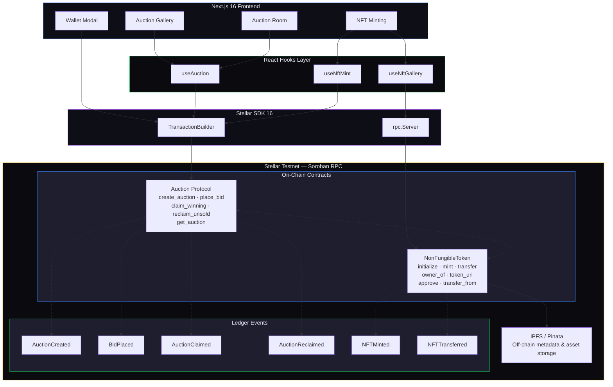
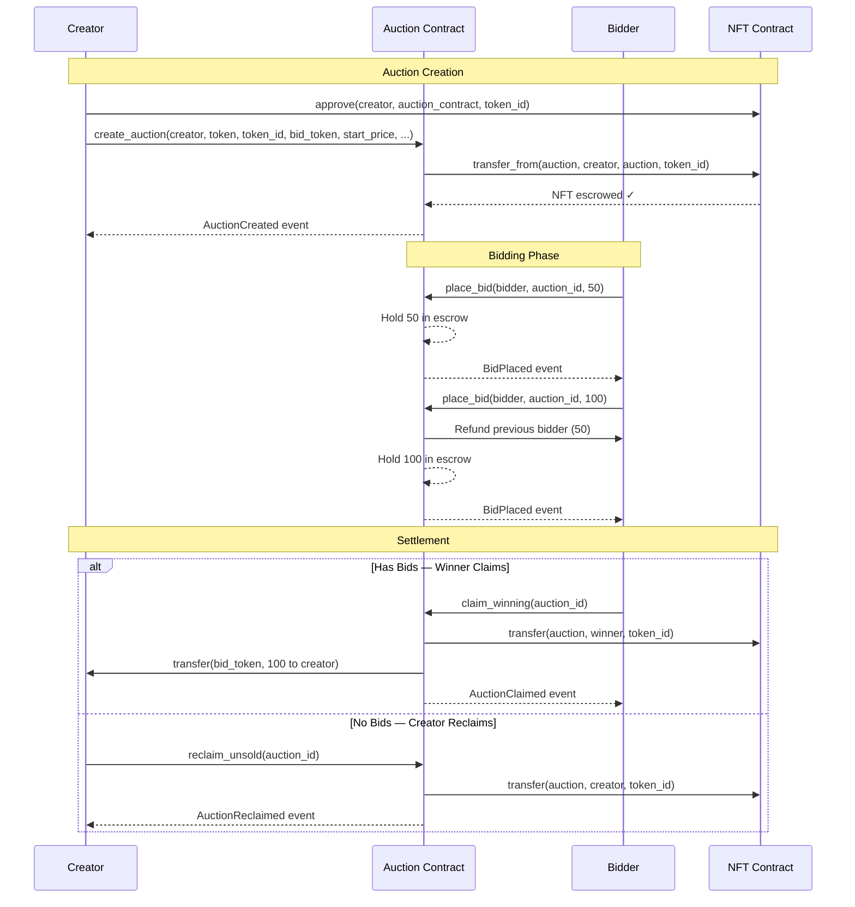
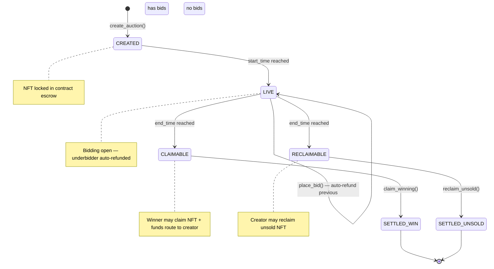
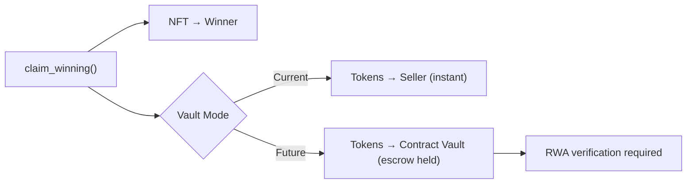
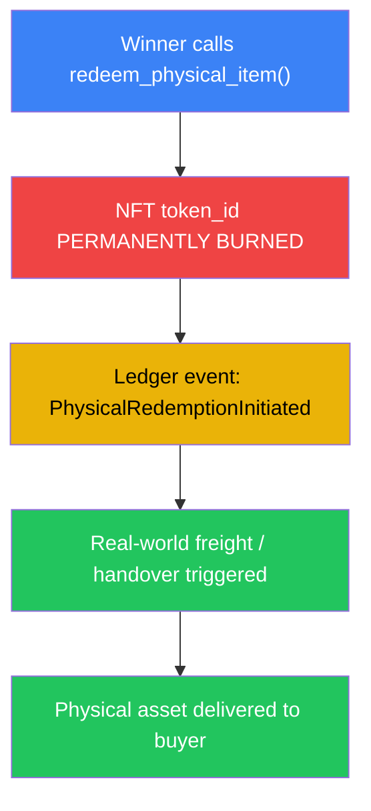
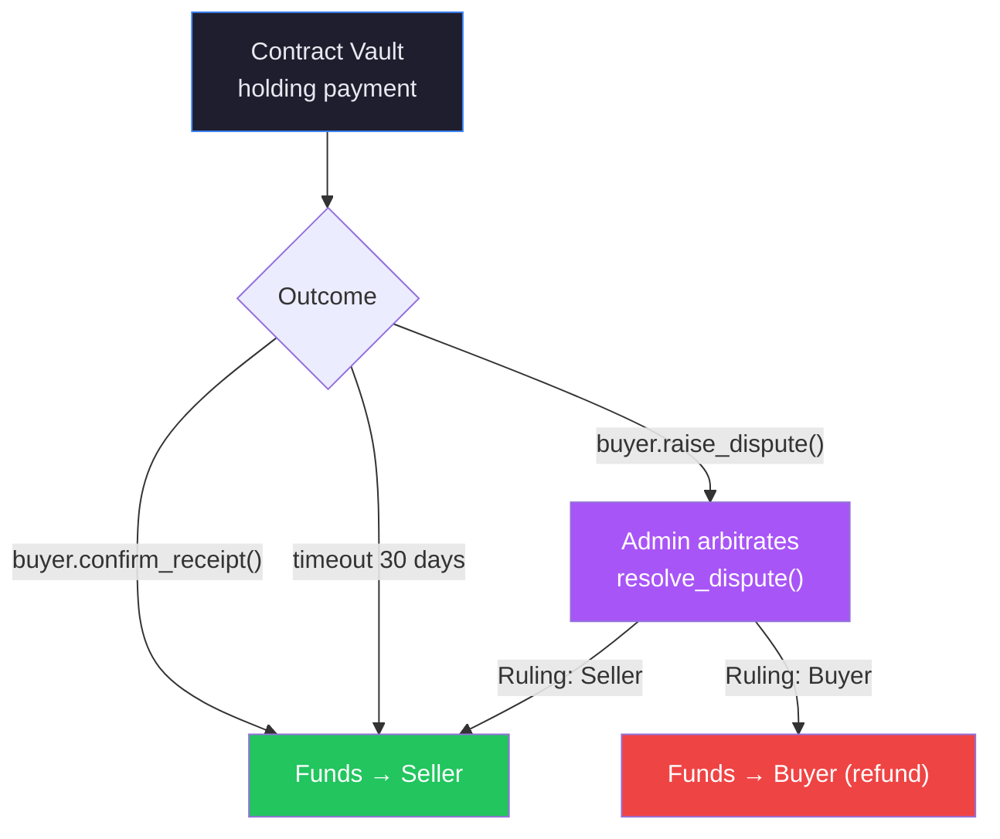

<div align="center">

# ⬡ ZENITH AUCTION

### Advanced Soroban NFT Auction Protocol on Stellar

**Bridging digital liquidity with unique physical assets via secure on-chain escrow and decentralized asset verification.**


---

</div>

## Table of Contents

- [Level 2 Completion Checklist](#-level-2-completion-checklist)
- [Architecture Overview](#-architecture-overview)
- [Screenshots & Preview](#-screenshots--preview)
- [Core Engineering Architecture](#-core-engineering-architecture)
- [Exclusive Production Features](#-exclusive-production-features)
- [Contract Addresses](#-contract-addresses-testnet)
- [Smart Contract API Reference](#-smart-contract-api-reference)
- [Frontend Architecture](#-frontend-architecture)
- [Future Roadmap & The RWA Bridge](#-future-roadmap--the-rwa-bridge)
- [Setup & Local Development](#-setup--local-development)
- [Project Structure](#-project-structure)
- [License](#-license)

---

## Level 2 Completion Checklist

| Requirement | Status | Details |
|---|---|---|
| **3 Error Types Handled** | ✅ | `Simulation failed`, `Transaction failed`, `Wallet not connected` + contract-level `NotFound`, `NotActive`, `BidTooLow`, `NotOnAllowlist`, `AlreadyClaimed`, `NoBids`, `HasBids`, `NotEnded`, `NotWinner` (9 on-chain errors) |
| **Contract Deployed on Testnet** | ✅ | Auction Protocol: `CB3MSS4J3YZCJXKP67KTUN2SR6LPPK3XZCJUSTCZ7BFSMFHBMCMY7FTY` · NFT Minting: `CDVMGOJB2OUCJQXUKVCBMOXPQXYPTARRP4BDPZFDBIGTLGRLIIA5PB4P` |
| **Contract Called from Frontend** | ✅ | `useAuction` hook builds, simulates, signs, and submits Soroban transactions for `create_auction`, `place_bid`, `claim_winning`, `reclaim_unsold` |
| **Transaction Status Visible** | ✅ | Real-time tx status (idle → submitting → error), spinner during signing, error messages displayed, post-claim diagnostics with TX hash and token balance |
| **Minimum 2+ Meaningful Commits** | ✅ | See git log — core contract, frontend scaffolding, and bid tracking features committed separately |

---

## Architecture Overview

Zenith Auction is a **dual-contract Soroban protocol** paired with a **Next.js 16** frontend, enabling non-custodial NFT auctions on the Stellar network. The system separates concerns into two on-chain contracts — an **NFT Minting Contract** for asset lifecycle management and an **Auction Protocol Contract** for the escrowed bidding engine — orchestrated through a rich client-side TypeScript layer.



---

## Screenshots & Preview

> **Note:** Replace the paths below with actual screenshots from your running application.
> Capture screenshots by running `npm run dev` in the `client/` directory and visiting each route.

### Home — Live Auction Feed

<p align="center">
  
</p>

*Real-time auction cards with live countdown timers, bid status indicators, and urgency color coding.*

### Auction Room — Bidding Interface

<p align="center">
  
</p>

*Full auction room with IPFS-resolved NFT metadata, bid activity tracker, countdown with urgency animations, and claim/reclaim settlement actions.*

### NFT Minting — IPFS Upload Flow

<p align="center">
  
</p>

*Multi-phase minting pipeline: upload to IPFS, initialize contract, sign Soroban transaction, ledger confirmation.*

### NFT Gallery — On-Chain Collection

<p align="center">
  
</p>

*Scans token IDs 1-50 on-chain, resolves IPFS metadata, and displays owned NFTs with images and titles.*

### Create Auction — Deployment Form

<p align="center">
  
</p>

*Full-featured creation form with NFT gallery auto-fill, bid token selection, private auction toggle with allowlist, and deployment dashboard.*

---

## Core Engineering Architecture

### 1. NonFungibleToken Contract — `nft_mint` (Soroban/Rust)

The NFT contract implements a **Soroban-native ERC-721 equivalent** for minting, ownership tracking, and cross-contract orchestration. It is intentionally decoupled from the auction logic to maintain single-responsibility separation.

| Method | Description |
|---|---|
| `initialize(admin)` | Sets the administrative authority and initializes the global token counter at `1`. Idempotent — safe to call repeatedly (returns `TokenAlreadyExists` on subsequent calls). |
| `mint(to, metadata_uri)` | Mints a new unique `i128` token ID linked to an immutable IPFS `ipfs://` metadata URI. Auto-increments the global counter. Emits `NFTMinted`. |
| `transfer(from, to, token_id)` | Owner-initiated direct transfer. Emits `NFTTransferred`. |
| `owner_of(token_id)` | Public getter returning the current holder address. |
| `token_uri(token_id)` | Public getter returning the IPFS metadata URI string. |
| `approve(owner, spender, token_id)` | Grants a spender (e.g., the Auction Contract) permission to transfer a specific token. |
| `transfer_from(spender, from, to, token_id)` | Executes a transfer on behalf of an approved spender — this is the mechanism the Auction Contract uses to escrow NFTs into auctions. |

```rust
// Minting flow — the contract returns an auto-incremented i128 token ID
let token_id: i128 = env
    .storage().instance()
    .get(&DataKey::NextTokenId)
    .unwrap_or(1i128);

env.storage().instance().set(&DataKey::TokenOwner(token_id), &to);
env.storage().instance().set(&DataKey::TokenUri(token_id), &metadata_uri);
env.storage().instance().set(&DataKey::NextTokenId, &(token_id + 1));
```

### 2. Auction Protocol Contract — `zenith-auction` (Soroban/Rust)

The auction contract is a **non-custodial, event-driven ledger engine** that supports dynamic starting prices, automated underbidder refunds, and cryptographic allowlists for private bidding.

| Method | Description |
|---|---|
| `init()` | Initializes the global auction ID counter at `1`. |
| `create_auction(creator, token, token_id, bid_token, start_price, start_time, end_time, is_private, allowlist)` | Locks the specified NFT into the contract via `transfer_from`, then stores the full auction struct. Emits `AuctionCreated`. |
| `place_bid(bidder, auction_id, amount)` | Validates timing, allowlist membership, and bid minimums. Auto-refunds the previous highest bidder. Emits `BidPlaced`. |
| `claim_winning(auction_id)` | After `end_time`, transfers the NFT to the winner and bid tokens to the creator. Emits `AuctionClaimed`. |
| `reclaim_unsold(auction_id)` | After `end_time`, with zero bids, returns the NFT to the creator. Emits `AuctionReclaimed`. |
| `get_auction(auction_id)` | Returns the full `Auction` struct. |



### Auction State Machine



---

## Exclusive Production Features

### Dynamic On-Chain to Off-Chain Decoupling

The smart contracts remain **ultra-gas-optimized by storing zero text strings** on-chain. The Next.js frontend dynamically performs cross-contract read calls to resolve the NFT's `token_uri`, parses the IPFS JSON metadata gateway via Pinata, and natively renders asset titles and images directly from the blockchain state.

```typescript
// nftMetadata.ts — the bridge between on-chain state and off-chain rendering
export async function fetchNftMetadata(
  nftContractAddress: string,
  tokenId: bigint,
): Promise<NftMetadata> {
  // Step 1: Read-only simulation call to token_uri(token_id) on the NFT contract
  const metadataUri = await simulateRead(server, nftContractAddress, "token_uri", [
    nativeToScVal(tokenId, { type: "i128" }),
  ]);

  // Step 2: Convert ipfs:// URI → Pinata gateway URL and fetch JSON
  const gatewayUrl = ipfsToGateway(metadataUri);
  const json = await fetch(gatewayUrl).then((r) => r.json());

  // Step 3: Extract name, description, image — render natively in React
  return {
    name: json.name,
    description: json.description,
    imageGateway: ipfsToGateway(json.image),
    metadataGateway: gatewayUrl,
  };
}
```

### Integrated Token ID Tracking

Full end-to-end support for tracking specific asset IDs (`token_id` as `i128`) across the entire structural lifetime of the auction, eliminating standard token collisions. The `token_id` flows through every layer:

```
Mint ──► token_id: i128 ──► approve() ──► create_auction(token_id) ──►
  lock in escrow ──► place_bid() (escrowed) ──► claim_winning() ──►
    transfer(token_id) to winner ──► NFT received with exact token_id
```

### Cryptographic Allowlists (Private Bidding)

Built-in **privacy gatekeeper** toggle supporting targeted auctions. Creators pass a Soroban `Vec<Address>` to lock the auction, enforcing that only pre-authorized wallets can invoke the `place_bid` pipeline.

```rust
// On-chain enforcement — the security gatekeeper
pub fn place_bid(env: Env, bidder: Address, auction_id: u64, amount: i128) -> Result<(), AuctionError> {
    let mut auction: Auction = env.storage().instance()
        .get(&DataKey::Auction(auction_id))
        .ok_or(AuctionError::NotFound)?;

    // Cryptographic allowlist check
    if auction.is_private {
        if !auction.allowlist.contains(&bidder) {
            return Err(AuctionError::NotOnAllowlist); // Error #9
        }
    }
    // ... proceed with bid validation
}
```

```typescript
// Frontend: allowlist is passed as a Soroban Vec<Address> via XDR
const allowlistScVals = allowlist.map((addr) => new Address(addr).toScVal());
const allowlistVec = xdr.ScVal.scvVec(allowlistScVals);

await submitTx("create_auction", [
  // ... other params
  xdr.ScVal.scvBool(isPrivate),
  allowlistVec,
]);
```

### Bid Activity Tracking

The frontend tracks bid state changes through periodic on-chain RPC polling (every 12s), displaying a real-time bid activity log with change detection, bidder identification, and relative timestamps.

### Automatic Underbidder Refunds

When a new bid exceeds the current highest, the contract **atomically refunds the previous bidder** in the same transaction — no manual claiming required.

```rust
// Atomic refund — executed inside place_bid()
if auction.highest_bid > 0 {
    token::Client::new(&env, &auction.bid_token).transfer(
        &env.current_contract_address(),
        &auction.highest_bidder,  // previous bidder
        auction.highest_bid,       // full refund amount
    );
}
```

### IPFS Upload Pipeline (Pinata)

The frontend includes a server-side API route (`/api/upload`) that handles the full IPFS upload lifecycle — file upload, metadata JSON construction, and Pinata pinning — returning both `ipfs://` URIs and human-readable gateway URLs.

### Multi-Wallet Support

The wallet integration layer (`@creit.tech/stellar-wallets-kit` + `@stellar/freighter-api`) supports connecting multiple Stellar wallet providers, with a Zustand-based state manager handling address persistence and transaction signing.

---

## Contract Addresses (Testnet)

| Contract | Address |
|---|---|
| **Auction Protocol** | `CB3MSS4J3YZCJXKP67KTUN2SR6LPPK3XZCJUSTCZ7BFSMFHBMCMY7FTY` |
| **NFT Minting** | `CDVMGOJB2OUCJQXUKVCBMOXPQXYPTARRP4BDPZFDBIGTLGRLIIA5PB4P` |
| **Network** | Stellar Testnet (`Test SDF Network ; September 2015`) |
| **RPC** | `https://soroban-testnet.stellar.org` |

---

## Smart Contract API Reference

### Auction Contract — `zenith-auction v0.1.2`

#### `init()`

Initializes the global auction ID counter. Must be called once before creating auctions.

```
Parameters:  (none)
Returns:     ()
```

#### `create_auction(...)`

Creates a new auction and escrows the specified NFT.

```
Parameters:
  creator:      Address     — The auction host (requires auth)
  token:        Address     — The NFT contract address
  token_id:     i128        — The specific token ID to escrow
  bid_token:    Address     — The token accepted for bids (e.g., XLM, USDC)
  start_price:  i128        — Minimum first bid (7 decimal precision)
  start_time:   u64         — Auction start (Unix timestamp)
  end_time:     u64         — Auction end (Unix timestamp)
  is_private:   bool        — Enable allowlist gating
  allowlist:    Vec<Address>— Allowed bidder addresses (empty if public)

Returns:      u64          — The auto-incremented auction ID
Events:       AuctionCreated { creator, auction_id, token_id, is_private }
```

#### `place_bid(bidder, auction_id, amount)`

Places a bid on a live auction. Auto-refunds the previous highest bidder.

```
Parameters:
  bidder:      Address     — The bidder (requires auth)
  auction_id:  u64         — Target auction
  amount:      i128        — Bid amount (7 decimal precision)

Returns:      Result<(), AuctionError>
Errors:       NotFound(1), NotActive(5), BidTooLow(4), NotOnAllowlist(9)
Events:       BidPlaced { auction_id, bidder, amount }
```

#### `claim_winning(auction_id)`

Claims the NFT after auction ends. Callable by the winner only.

```
Parameters:
  auction_id:  u64         — Target auction

Returns:      Result<(), AuctionError>
Errors:       NotFound(1), NotEnded(2), AlreadyClaimed(3), NoBids(7)
Events:       AuctionClaimed { auction_id, winner, creator, amount, token_id }
```

#### `reclaim_unsold(auction_id)`

Reclaims the NFT after auction ends with zero bids. Callable by the creator only.

```
Parameters:
  auction_id:  u64         — Target auction

Returns:      Result<(), AuctionError>
Errors:       NotFound(1), NotEnded(2), AlreadyClaimed(3), HasBids(8)
Events:       AuctionReclaimed { auction_id, creator, token_id }
```

#### `get_auction(auction_id)`

Read-only query returning the full auction struct.

```
Parameters:
  auction_id:  u64         — Target auction

Returns:      Result<Auction, AuctionError>
```

### NFT Contract — `nft_mint v0.1.1`

| Method | Auth Required | Returns |
|---|---|---|
| `initialize(admin)` | Yes | `Result<(), NFTError>` |
| `mint(to, metadata_uri)` | Yes (admin) | `Result<i128, NFTError>` |
| `transfer(from, to, token_id)` | Yes (from) | `Result<(), NFTError>` |
| `owner_of(token_id)` | No | `Result<Address, NFTError>` |
| `token_uri(token_id)` | No | `Result<String, NFTError>` |
| `approve(owner, spender, token_id)` | Yes (owner) | `Result<(), NFTError>` |
| `transfer_from(spender, from, to, token_id)` | Yes (spender) | `Result<(), NFTError>` |

### Error Codes

| Code | Auction Contract | NFT Contract |
|---|---|---|
| 1 | `NotFound` | `NotAuthorized` |
| 2 | `NotEnded` | `TokenNotFound` |
| 3 | `AlreadyClaimed` | `TokenAlreadyExists` |
| 4 | `BidTooLow` | `NotInitialized` |
| 5 | `NotActive` | — |
| 6 | `NotWinner` | — |
| 7 | `NoBids` | — |
| 8 | `HasBids` | — |
| 9 | `NotOnAllowlist` | — |

---

## Frontend Architecture

### Technology Stack

| Layer | Technology | Purpose |
|---|---|---|
| Framework | Next.js 16 (App Router) | Server/client component architecture, API routes |
| Language | TypeScript 5 | Type-safe contract interactions |
| Styling | Tailwind CSS 4 | Brutalist dark UI system |
| State | Zustand 5 | Client-side auction + wallet state management |
| Wallet | Freighter + Stellar Wallets Kit | Multi-wallet connection + XDR signing |
| Blockchain | Stellar SDK 16 | Soroban RPC, transaction building, on-chain state polling |
| Storage | IPFS via Pinata | Decentralized NFT metadata + asset hosting |
| Icons | Lucide React | UI iconography |

### Page Routes

| Route | Description |
|---|---|
| `/` | Home page — live auction feed with real-time countdown cards |
| `/create` | Auction creation form — auto-fillable from NFT gallery |
| `/mint` | NFT minting interface — upload asset to IPFS, mint on-chain |
| `/nfts` | On-chain NFT gallery — scans token IDs 1–50, resolves IPFS metadata |
| `/auction/[id]` | Auction room — bid activity tracker, countdown, bid/claim/reclaim actions |

### State Management

```
┌──────────────────────────────────────────────────┐
│                 ZUSTAND STORES                    │
├──────────────────────────────────────────────────┤
│                                                   │
│  walletStore              auctionStore            │
│  ├── address: string      ├── auction: Details    │
│  ├── isConnecting         ├── auctions: Details[] │
│  ├── connect()            ├── isLoading           │
│  ├── disconnect()         ├── error               │
│  └── signTx()             └── setAuction()        │
│                                                   │
│  nftStore                                        │
│  ├── nfts: LocalNft[]                            │
│  └── addNft()                                    │
└──────────────────────────────────────────────────┘
```

### Key Hooks

| Hook | Purpose |
|---|---|
| `useAuction` | Core contract interaction — `createAuction`, `placeBid`, `claimWinning`, `reclaimUnsold`, `getAuctionDetails`, `fetchAllAuctions`, `getTokenBalance` |
| `useNftMint` | NFT minting pipeline — handles IPFS upload, contract initialization, Soroban mint transaction, phase state machine (`idle` → `uploading` → `initializing` → `minting` → `confirming` → `success`) |
| `useNftGallery` | On-chain gallery scanner — scans token IDs 1–50, filters by connected wallet ownership, resolves IPFS metadata for each owned token |

---

## Future Roadmap & The RWA Bridge

The platform is architecting a path toward becoming an elite **Real World Asset (RWA) engine** through a **Burn-to-Redeem Escrow & Multi-Sig Oracle** design.

### Phase 1: On-Chain Escrow Holding

> *Modifying `claim_winning` to hold funds in the contract vault instead of routing to the seller.*



The auction contract becomes a true **non-custodial escrow agent**, holding payment tokens until real-world conditions are verified.

### Phase 2: Burn-to-Redeem Trigger

> *The winner invokes `redeem_physical_item()`, permanently burning their digital NFT claim ticket.*



This creates an **irreversible digital-to-physical bridge** — the on-chain NFT ceases to exist as the physical asset enters the fulfillment pipeline.

### Phase 3: Dual-Signature Settlement (The Oracle Path)

> *Funds unlocked to seller only when buyer confirms receipt. Admin-mediated dispute resolution.*



**Dispute Resolution Protocol:**

| Function | Actor | Description |
|---|---|---|
| `confirm_receipt()` | Buyer | Signals physical delivery confirmed. Unlocks funds to seller. |
| `raise_dispute()` | Buyer | Initiates dispute within the confirmation window. |
| `resolve_dispute(ruling)` | Admin | Decentralized arbitrator — rules in favor of buyer or seller. |
| `claim_refund()` | Buyer | If dispute ruled in buyer's favor — returns funds. |

---

## Setup & Local Development

### Prerequisites

- [Rust](https://rustup.rs/) (stable toolchain)
- [Soroban CLI](https://soroban.stellar.org/docs/getting-started/setup) v25+
- [Node.js](https://nodejs.org/) v18+ and npm/bun
- [Stellar CLI](https://github.com/stellar/stellar-cli) (`soroban` command)

### Smart Contracts

```bash
# Navigate to the contract workspace
cd contract

# Build both contracts
soroban contract build

# Run tests
cargo test

# Deploy to Testnet (requires funded deployer account)
soroban contract deploy \
  --wasm target/wasm32-unknown-unknown/release/zenith_auction.wasm \
  --network testnet

soroban contract deploy \
  --wasm target/wasm32-unknown-unknown/release/nft_mint.wasm \
  --network testnet

# Initialize the contracts after deployment
soroban contract invoke --network testnet \
  --id <AUCTION_CONTRACT_ADDRESS> \
  --fn init

soroban contract invoke --network testnet \
  --id <NFT_CONTRACT_ADDRESS> \
  --fn initialize \
  --arg <ADMIN_ADDRESS>
```

Update the contract addresses in `client/src/lib/constants.ts`:

```typescript
export const CONTRACT_ADDRESS = "<YOUR_AUCTION_CONTRACT_ADDRESS>";
export const NFT_CONTRACT_ADDRESS = "<YOUR_NFT_CONTRACT_ADDRESS>";
```

### Frontend Client

```bash
# Navigate to the client directory
cd client

# Install dependencies
npm install

# Start the development server
npm run dev

# Build for production
npm run build
```

Open [http://localhost:3000](http://localhost:3000) in your browser.

### Environment Variables

Create a `.env.local` in the `client/` directory if using a custom Pinata setup:

```env
# Pinata IPFS (used by /api/upload route)
PINATA_API_KEY=your_pinata_api_key
PINATA_SECRET_KEY=your_pinata_secret_key
```

---

## Project Structure

```
zenith-auction/
├── README.md
├── package.json                          # Workspace root
│
├── contract/                             # Soroban smart contracts
│   ├── Cargo.toml                        # Workspace config (soroban-sdk v25)
│   ├── Cargo.lock
│   │
│   ├── contracts/contract/               # Auction Protocol Contract
│   │   ├── Cargo.toml                    # zenith-auction v0.1.2
│   │   ├── Makefile
│   │   ├── src/
│   │   │   ├── lib.rs                    # Core auction logic
│   │   │   └── test.rs                   # Integration tests
│   │   └── test_snapshots/               # Test output snapshots
│   │
│   └── nft_contract/nft_auction/         # NFT Minting Contract
│       ├── contracts/nft_mint/
│       │   ├── Cargo.toml                # nft_mint v0.1.1
│       │   ├── Makefile
│       │   └── src/
│       │       ├── lib.rs                # ERC-721 equivalent logic
│       │       └── test.rs
│       └── README.md
│
└── client/                               # Next.js 16 frontend
    ├── package.json                      # React 19, Stellar SDK 16, Zustand 5
    ├── next.config.ts                    # IPFS gateway image patterns
    ├── postcss.config.mjs                 # PostCSS + Tailwind config
    ├── tsconfig.json
    │
    └── src/
        ├── app/                          # App Router pages
        │   ├── layout.tsx                # Root layout + wallet provider
        │   ├── page.tsx                  # Home — live auction feed
        │   ├── globals.css               # Brutalist design system
        │   ├── auction/[id]/page.tsx     # Auction room (dynamic)
        │   ├── create/page.tsx           # Auction creation form
        │   ├── mint/page.tsx             # NFT minting interface
        │   ├── nfts/page.tsx             # On-chain NFT gallery
        │   └── api/upload/route.ts       # IPFS upload endpoint
        │
        ├── components/                   # React components
        │   ├── Navbar.tsx                # Top navigation bar
        │   ├── WalletModal.tsx           # Wallet connection modal
        │   ├── AuctionCard.tsx           # Auction preview card
        │   ├── AuctionRoom.tsx           # Full auction room UI
        │   ├── BidButton.tsx             # Bid action component
        │   └── MintAssetForm.tsx         # NFT minting form
        │
        ├── hooks/                        # Custom React hooks
        │   ├── useAuction.ts             # Auction contract interaction
        │   ├── useNftMint.ts             # NFT minting pipeline
        │   └── useNftGallery.ts          # On-chain gallery scanner
        │
        ├── store/                        # Zustand state stores
        │   ├── walletStore.ts            # Wallet connection state
        │   ├── auctionStore.ts           # Auction + bid history state
        │   └── nftStore.ts               # Local NFT registry
        │
        └── lib/                          # Shared utilities
            ├── constants.ts              # Contract addresses, network config
            ├── format.ts                 # Amount/duration formatting
            └── nftMetadata.ts            # IPFS metadata resolution
```

---

## License

MIT © Zenith Auction Protocol

---

<div align="center">

**Built on [Stellar](https://stellar.org) • Powered by [Soroban](https://soroban.stellar.org) • Designed for the future of Real World Assets**

</div>